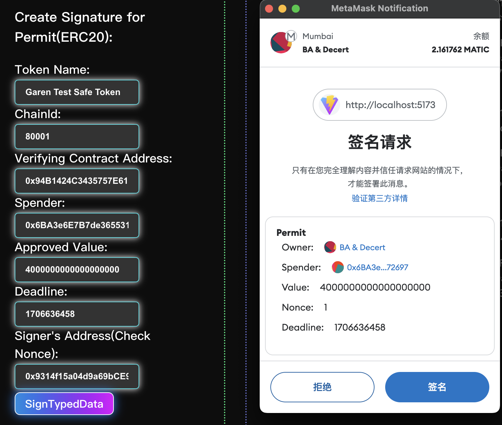

# 练习题（01.24）


## 1. 在以太坊上用ERC20 模拟铭文铸造，创建工厂合约

**ERC20TokenFactory合约已部署**：https://mumbai.polygonscan.com/address/0xE37634EF6f122899d66B056f3C3e4C9bfF8c4aA4

**由工厂合约部署的一个合约实例**：https://mumbai.polygonscan.com/address/0xf738C2Ef2b7BD4A8C8173aBBBb07d3683B3c9d12

**FairTokenGFT 合约（implement 合约）**：https://mumbai.polygonscan.com/address/0x7d92cBCB8557d6366C82B14d0A3409F42a61d73e


### ( 1 ) 工厂合约：ERC20TokenFactory

#### **此合约部分状态变量与方法的说明：**

- **状态变量`libraryAddress`**：implement 合约的地址。

- **状态变量`InscriptionStruct`**：结构体，用于记录本工厂合约所部署的合约实例的信息（`name`、`symbol`、`totalSupply`、`perMint`）。

- **状态变量`inscriptionInfo`**：映射[ `合约实例地址` => `InscriptionStruct` ]。

- **事件`ImpleCloned`**：记录本工厂合约所部署的合约实例的地址，随`deployInscription`的调用而触发。

- **`deployInscription`方法**：使用 `Clone` 库中的 `clone` 方法基于 implement 合约的逻辑部署新的 ERC20 Token 合约实例，部署方式为内联汇编（这将导致在部署时不会运行 implement 合约中 `constructor`中的代码，需要在新部署的合约实例中增设 `init` 方法“手动”初始化）。

- **`mintInscription`方法**：调用指定地址的 ERC20 Token 合约（由工厂合约部署合约实例）mint 方法为调用者铸造该合约实例的 token（token 数额为固定值，在调用`deployInscription` 方法创建合约实例时，由输入参数 `_perMint`确定）。

- **`setLibraryAddress`方法**：`onlyOwner`，指定 implement 合约的地址，便于升级/维护。

- **`setMaxAmountOfInscription`方法**：`onlyOwner`，指定最大可部署的合约实例数额（用于管理该合约）。

```solidity
// SPDX-License-Identifier: MIT
pragma solidity ^0.8.19;

import "./FairTokenGFT.sol";
import "@openzeppelin/contracts/proxy/Clones.sol";
import "@openzeppelin/contracts/access/Ownable.sol";

/**
 * @title This is a factory contract that clones ERC20Token contract instance as inscription
 *
 * @author Garen Woo
 */
contract ERC20TokenFactory is Ownable {
    using Clones for address;

    // This is the address of the implement contract(template of ERC20Token contract)
    address private libraryAddress;
    struct InscriptionStruct {
        string name;
        string symbol;
        uint256 totalSupply;
        uint256 perMint;
    }
    mapping(address => InscriptionStruct) public inscriptionInfo;
    event ImpleCloned(address instanceAddress);

    /**
     * @notice maxAmountOfInscription is a deterministic number that limits the maximum amount of inscription.
     * This parameter set a cap to avoid transaction failure which results from over-high gas.
     * This state variable can be modified by owner of this factory.
     */
    uint public maxAmountOfInscription = 200;

    constructor(address _libraryAddress) Ownable(msg.sender) {
        libraryAddress = _libraryAddress;
    }

    /**
     * @dev Using the implement contract of libraryAddress, deploy its contract instance.
     *
     * @param _tokenName the name of the ERC20 token contract that will be deployed
     * @param _tokenSymbol the symbol of the ERC20 token contract that will be deployed
     * @param _tokenTotalSupply the maximum of the token supply(if this maximum is reached, token cannot been minted any more)
     * @param _perMint the fixed amount of token that can be minted once
     */
    function deployInscription(
        string memory _tokenName,
        string memory _tokenSymbol,
        uint256 _tokenTotalSupply,
        uint256 _perMint
    ) public {
        address clonedImpleInstance = libraryAddress.clone();
        InscriptionStruct memory deployedInscription = InscriptionStruct({
            name: _tokenName,
            symbol: _tokenSymbol,
            totalSupply: _tokenTotalSupply,
            perMint: _perMint
        });
        inscriptionInfo[clonedImpleInstance] = deployedInscription;

        FairTokenGFT(clonedImpleInstance).init(
            _tokenName,
            _tokenSymbol,
            _tokenTotalSupply,
            _perMint
        );
        emit ImpleCloned(clonedImpleInstance);
    }

    /**
     * @dev Mint fixed amount of token in the contract of '_tokenAddr'.
     *
     * @param _tokenAddr the address of the contract instance which is cloned from the implement contract
     */
    function mintInscription(address _tokenAddr) public {
        FairTokenGFT(_tokenAddr).mint(msg.sender);
    }

    /**
     * @notice This function is used to get the current total amount of minted token. It's for the convenience of knowing
     * if the current total amount has reached the maximum.
     *
     * @param _tokenAddr the address of the contract instance which is cloned from the implement contract
     */
    function getInscriptionCurrentSupply(
        address _tokenAddr
    ) public view returns (uint256) {
        return FairTokenGFT(_tokenAddr).totalSupply();
    }

    /**
     * @dev Replace the address of the implement contract with a new one.
     * This function can only be called by the owner of this factory contract.
     */
    function setLibraryAddress(address _libraryAddr) public onlyOwner {
        libraryAddress = _libraryAddr;
    }

    /**
     * @dev Get the current address of the implement contract
     */
    function getLibraryAddress() public view returns (address) {
        return libraryAddress;
    }

    /**
     * @dev Update the maximum of the ERC20 token contract instances
     */
    function setMaxAmountOfInscription(uint _max) external onlyOwner {
        maxAmountOfInscription = _max;
    }
}
```


### ( 2 ) ERC20 Token 合约：FairTokenGFT

此合约为使用最小代理方式部署新合约实例的 implement 合约（也是逻辑合约）。

需注意的是，新的合约实例由`Clone`库的`clone`方法部署，该方法是通过内联汇编实现的，导致无法运行 implement 合约的`constructor`。

#### **此合约部分状态变量与方法的说明：**

- **状态变量`_name`和`_symbol`**：由于部署合约未运行`constructor`中的赋值操作，导致 <u>ERC20 标准实现</u>的`_name` 和`_symbol`无法被赋值；此外，ERC20 Token 的`_name` 和`_symbol`为 <u>ERC20 标准实现</u>的私有变量，无法被子合约（`FairTokenGFT`）直接访问或修改。因此，在当前合约声明此两个私有的状态变量，用于模拟 <u>ERC20 标准实现</u>中的`_name` 和 `_symbol`。

- **状态变量`maxSupply`**：此合约 Token 数量的上限。
- **状态变量`amountPerMint`**：每次 mint 的数额，固定值。

- **错误 `ReachMaxSupply`**：当<u>铸造数量+当前总供应量</u>超过`maxSupply`则回滚交易并返回此错误。

- **`init`方法**：用于模拟`constructor`的初始化 。

```solidity
// SPDX-License-Identifier: MIT
pragma solidity ^0.8.0;

import "@openzeppelin/contracts/token/ERC20/ERC20.sol";
import "@openzeppelin/contracts/token/ERC20/extensions/ERC20Permit.sol";
import "@openzeppelin/contracts/utils/ReentrancyGuard.sol";
import "@openzeppelin/contracts/utils/Address.sol";
import "@openzeppelin/contracts/token/ERC20/utils/SafeERC20.sol";

interface ITokenBank {
    function tokensReceived(address, uint) external returns (bool);
}

interface INFTMarket {
    function tokensReceived(address, address, uint, bytes calldata) external;
}

contract FairTokenGFT is ERC20, ERC20Permit, ReentrancyGuard {
    using SafeERC20 for FairTokenGFT;
    using Address for address;
    address public owner;
    string private _name;
    string private _symbol;
    uint256 public maxSupply;
    uint256 public amountPerMint;
    error NotOwner(address caller);
    error NoTokenReceived();
    error transferTokenFail();
    error NotContract();
    error ReachMaxSupply(uint256 currentTotalSupply);
    event TokenMinted(uint amount, uint timestamp);

    constructor()
        ERC20("Garen Fair Token", "GFT")
        ERC20Permit("Garen Fair Token")
    {
        owner = msg.sender;
        /// @dev Initial totalsupply is 100,000
        _mint(msg.sender, 100000 * (10 ** uint256(decimals())));
    }

    modifier onlyOwner() {
        if (msg.sender != owner) {
            revert NotOwner(msg.sender);
        }
        _;
    }

    function init(
        string calldata _initName,
        string calldata _initSymbol,
        uint256 _initTotalSupply,
        uint256 _initPerMint
    ) external {
        _name = _initName;
        _symbol = _initSymbol;
        maxSupply = _initTotalSupply;
        amountPerMint = _initPerMint;
    }

    function mint(address _recipient) external {
        uint256 currentTotalSupply = totalSupply();
        if (currentTotalSupply + amountPerMint > maxSupply) {
            revert ReachMaxSupply(currentTotalSupply);
        }
        _mint(_recipient, amountPerMint);
        emit TokenMinted(amountPerMint, block.timestamp);
    }

    // ERC20 Token Callback:
    function transferWithCallback(
        address _to,
        uint _amount
    ) external nonReentrant returns (bool) {
        bool transferSuccess = transfer(_to, _amount);
        if (!transferSuccess) {
            revert transferTokenFail();
        }
        if (_isContract(_to)) {
            bool success = ITokenBank(_to).tokensReceived(msg.sender, _amount);
            if (!success) {
                revert NoTokenReceived();
            }
        }
        return true;
    }

    // ERC721 Token Callback:
    // @param: _data contains information of NFT, including ERC721Token address, tokenId and other potential information.
    function transferWithCallbackForNFT(
        address _to,
        uint _bidAmount,
        bytes calldata _data
    ) external nonReentrant returns (bool) {
        if (_isContract(_to)) {
            INFTMarket(_to).tokensReceived(msg.sender, _to, _bidAmount, _data);
        } else {
            revert NotContract();
        }
        return true;
    }

    function getBytesOfNFTInfo(
        address _NFTAddr,
        uint256 _tokenId
    ) public pure returns (bytes memory) {
        bytes memory NFTInfo = abi.encode(_NFTAddr, _tokenId);
        return NFTInfo;
    }

    function _isContract(address account) internal view returns (bool) {
        return account.code.length > 0;
    }
}
```

## 

## 2. 使用 EIP2612 标准 Token ，使用签名的方式 deposite

**ERC777Token_GTST 合约已部署**：https://mumbai.polygonscan.com/address/0x94B1424C3435757E611F27543eedB37bcD3BDEb4

**SuperBank 合约已部署**：https://mumbai.polygonscan.com/address/0x6BA3e6E7B7de36553177AD35138768bcEb872697


### ( 1 ) 离线签名

如下图所示，签名信息已实现 **EIP-712** 格式。

签名使用的前端代码 https://github.com/GarenWoo/0119-0122_NFTMarketDapp/blob/main/src/App.tsx 




#### **签名内容**：

**Token Name**：Garen Test Safe Token

**chainId**：80001

**Verifying Contract Address**：0x94B1424C3435757E611F27543eedB37bcD3BDEb4

**Buyer**：0x9314f15a04d9a69bCE94758e535e49c4e6c6770E

**tokenId**：4000000000000000000

**Deadline**：1706636458


#### **签名信息**：


**signature**：0x3229631a3b4127e98e4e6e7c8425b021c832775a3502022f13bbe3aad87ecb2622f420e0019edc4e4a92db9258e947c039d253326a08d7beaadb73c8752ce7c91b

**`v`**：27

**`r`**：0x3229631a3b4127e98e4e6e7c8425b021c832775a3502022f13bbe3aad87ecb26

**`s`**：0x22f420e0019edc4e4a92db9258e947c039d253326a08d7beaadb73c8752ce7c9


### ( 2 ) 验证签名

调用 **SuperBank** 合约`depositTokenWithPermit`方法来实现 token 的离线`approve` ，将如下信息和已获得的 **`v`**、**`r`**、**`s`**输入到该方法中来验证签名：

**`_tokenAddr`**：0x94B1424C3435757E611F27543eedB37bcD3BDEb4

**`_tokenAmount`**（要授权的额度）：4000000000000000000

**`_deadline`**：1706636458

交易信息（成功）：https://mumbai.polygonscan.com/tx/0xd48438c92f9fc8888ed4a819d4d0fa204b00931b37028c8be092dc254d000c69


### ( 3 ) 实现签名 Deposit 的合约（SuperBank 合约）：

```solidity
// SPDX-License-Identifier: MIT
pragma solidity ^0.8.0;

import "./Bank.sol";
import "@openzeppelin/contracts/token/ERC20/utils/SafeERC20.sol";
import "@openzeppelin/contracts/token/ERC20/extensions/ERC20Permit.sol";

// @dev SuperBank can receive ETH, any ERC20 tokens and any SafeERC20 tokens.
contract SuperBank is Bank {
    mapping(address => mapping(address => uint)) internal tokenBalance;
    address[3] internal tokenRank;
    IERC20 public iERC20Token;
    using SafeERC20 for IERC20;
    event tokenReceived(address sender, uint amount);

    constructor() {
        owner = msg.sender;
    }

    function depositToken(address _tokenAddr, uint _tokenAmount) public {
        iERC20Token = IERC20(_tokenAddr);
        /* 
        Considering the design of those functions with the prefix of 'safe' in SafeERC20 contract,
        if the token does not support safeTransferFrom, it will turn to call transferFrom instead.
        */
        iERC20Token.safeTransferFrom(msg.sender, address(this), _tokenAmount);
        tokenBalance[_tokenAddr][msg.sender] += _tokenAmount;
        _handleRankWhenDepositToken(_tokenAddr);
    }

    function depositTokenWithPermit(
        address _tokenAddr,
        uint _tokenAmount,
        uint _deadline,
        uint8 _v,
        bytes32 _r,
        bytes32 _s
    ) public {
        IERC20Permit(_tokenAddr).permit(msg.sender, address(this), _tokenAmount, _deadline, _v, _r, _s);
        iERC20Token = IERC20(_tokenAddr);
        /* 
        Considering the design of those functions with the prefix of 'safe' in SafeERC20 contract,
        if the token does not support safeTransferFrom, it will turn to call transferFrom instead.
        */
        iERC20Token.safeTransferFrom(msg.sender, address(this), _tokenAmount);
        tokenBalance[_tokenAddr][msg.sender] += _tokenAmount;
        _handleRankWhenDepositToken(_tokenAddr);
    }

    function withdrawToken(address _tokenAddr) public onlyOwner {
        iERC20Token = IERC20(_tokenAddr);
        /* 
        Considering the design of those functions with the prefix of 'safe' in SafeERC20 contract,
        if the token does not support safeTransfer, it will turn to call transfer instead.
        */
        iERC20Token.safeTransfer(owner, iERC20Token.balanceOf(address(this)));
    }

    function tokensReceived(
        address _tokenAddr,
        address _from,
        uint _amount
    ) external returns (bool) {
        tokenBalance[_tokenAddr][_from] += _amount;
        emit tokenReceived(_from, _amount);
        return true;
    }

    function getTokenBalance(
        address _tokenAddr,
        address _account
    ) public view returns (uint) {
        return tokenBalance[_tokenAddr][_account];
    }

    function getTokenTopThreeAccount()
        public
        view
        returns (address, address, address)
    {
        return (tokenRank[0], tokenRank[1], tokenRank[2]);
    }

    function _handleRankWhenDepositToken(address _tokenAddr) internal {
        uint membershipIndex = _checkTokenRankMembership();
        uint convertedIndex;
        uint indexRecord = 777;
        if (membershipIndex != 999) {
            // Case 1: msg.sender is already inside the top3 rank.
            convertedIndex = membershipIndex + 4;
            for (uint i = convertedIndex - 3; i > 1; i--) {
                if (membershipIndex != 0) {
                    if (
                        tokenBalance[_tokenAddr][msg.sender] >=
                        tokenBalance[_tokenAddr][tokenRank[i - 2]]
                    ) {
                        indexRecord = i - 2;
                        for (uint j = 2; j > i - 2; j--) {
                            tokenRank[j] = tokenRank[j - 1];
                        }
                        // Boundry condition
                        if (indexRecord == 0) {
                            tokenRank[indexRecord] = msg.sender;
                        }
                    } else {
                        if (indexRecord != 777) {
                            tokenRank[indexRecord] = msg.sender;
                        }
                    }
                }
            }
        } else {
            // Case 2: msg.sender is not inside the top3 rank.
            for (uint i = 3; i > 0; i--) {
                if (
                    tokenBalance[_tokenAddr][msg.sender] >=
                    tokenBalance[_tokenAddr][tokenRank[i - 1]]
                ) {
                    indexRecord = i - 1;
                    // move backward the element(s) which is(/are) right at the index and also behind the index
                    for (uint j = 2; j > i - 1; j--) {
                        tokenRank[j] = tokenRank[j - 1];
                    }
                    // Boundry condition
                    if (indexRecord == 0) {
                        tokenRank[indexRecord] = msg.sender;
                    }
                } else {
                    if (indexRecord != 777) {
                        tokenRank[indexRecord] = msg.sender;
                    }
                }
            }
        }
    }

    function _checkTokenRankMembership() internal view returns (uint) {
        uint index = 999;
        for (uint i = 0; i < 3; i++) {
            if (tokenRank[i] == msg.sender) {
                index = i;
                break;
            }
        }
        return index;
    }
}
```


### ( 4 ) 实现 EIP2612 的合约（ERC777Token_GTST 合约）：

```solidity
// SPDX-License-Identifier: MIT
pragma solidity ^0.8.0;

import "@openzeppelin/contracts/token/ERC20/ERC20.sol";
import "@openzeppelin/contracts/token/ERC20/extensions/ERC20Permit.sol";
import "@openzeppelin/contracts/utils/ReentrancyGuard.sol";
import "@openzeppelin/contracts/utils/Address.sol";
import "@openzeppelin/contracts/token/ERC20/utils/SafeERC20.sol";

interface ITokenBank {
    function tokensReceived(address, uint) external returns (bool);
}

interface INFTMarket {
    function tokensReceived(
        address,
        uint,
        bytes calldata
    ) external;
}

contract ERC777Token_GTST is ERC20, ERC20Permit, ReentrancyGuard {
    using SafeERC20 for ERC777Token_GTST;
    using Address for address;
    address public owner;
    error NotOwner(address caller);
    error NoTokenReceived();
    error transferTokenFail();
    error NotContract();
    event TokenMinted(uint amount, uint timestamp);

    constructor()
        ERC20("Garen Test Safe Token", "GTST")
        ERC20Permit("Garen Test Safe Token")
    {
        owner = msg.sender;
        /// @dev Initial totalsupply is 100,000
        _mint(msg.sender, 100000 * (10 ** uint256(decimals())));
    }

    modifier onlyOwner() {
        if (msg.sender != owner) {
            revert NotOwner(msg.sender);
        }
        _;
    }

    function mint(address _recipient, uint _amount) external onlyOwner {
        _mint(_recipient, _amount);
        emit TokenMinted(_amount, block.timestamp);
    }

    // ERC20 Token Callback:
    function transferWithCallback(
        address _to,
        uint _amount
    ) external nonReentrant returns (bool) {
        bool transferSuccess = transfer(_to, _amount);
        if (!transferSuccess) {
            revert transferTokenFail();
        }
        if (_isContract(_to)) {
            bool success = ITokenBank(_to).tokensReceived(msg.sender, _amount);
            if (!success) {
                revert NoTokenReceived();
            }
        }
        return true;
    }

    // ERC721 Token Callback:
    // @param: _data contains information of NFT, including ERC721Token address, tokenId and other potential information.
    function transferWithCallbackForNFT(
        address _to,
        uint _bidAmount,
        bytes calldata _data
    ) external nonReentrant returns (bool) {
        if (_isContract(_to)) {
            INFTMarket(_to).tokensReceived(msg.sender, _bidAmount, _data);
        } else {
            revert NotContract();
        }
        return true;
    }

    function getBytesOfNFTInfo(
        address _NFTAddr,
        uint256 _tokenId
    ) public pure returns (bytes memory) {
        bytes memory NFTInfo = abi.encode(_NFTAddr, _tokenId);
        return NFTInfo;
    }

    function _isContract(address account) internal view returns (bool) {
        return account.code.length > 0;
    }
}
```


## 3. 离线授权的白名单地址才可购买 NFT

**ERC721TokenWithPermit 合约已部署**：https://mumbai.polygonscan.com/address/0xFE6b4b135199A3e98A997321BcF9c6AC5A113247

**NFTMarketV2 合约已部署**：https://mumbai.polygonscan.com/address/0xba66A8d3977Bf60de733B8ce7Ef6BE9BEE27f3a5


### （ 1 ）离线签名

如下图所示，签名信息已实现 **EIP-712** 格式。

[签名使用的前端代码]: https://github.com/GarenWoo/0119-0122_NFTMarketDapp/blob/main/src/App.tsx


#### **签名内容**：

**Token Name**：Garen at OpenSpace

**chainId**：80001

**Verifying Contract Address**：0xFE6b4b135199A3e98A997321BcF9c6AC5A113247

**Buyer**：0x028e84e3452738CAD904FD6c24a1Cb4A1855695E

**tokenId**：1

**Deadline**：1706636458


#### **签名信息**：


**signature**：0xf43a63e8062eac4cd5058dde3fbcaed087fce196fd6de9fed6032f49ba3e172e5a19085e4264af0dc0e786bdcf9ebaf55087acdd2f97e74a57d7a5a3e0ed453b1b

**`v`**：27

**`r`**：0xf43a63e8062eac4cd5058dde3fbcaed087fce196fd6de9fed6032f49ba3e172e

**`s`**：0x5a19085e4264af0dc0e786bdcf9ebaf55087acdd2f97e74a57d7a5a3e0ed453b


### ( 2 ) 验证签名

调用 **NFTMarketV2** 合约`buyWithPermit`方法来购买已上架的 NFT ，将如下信息和已获得的 **`v`**、**`r`**、**`s`**输入到该方法中来验证签名：

**`_nftAddr`**：0xFE6b4b135199A3e98A997321BcF9c6AC5A113247

**`_tokenId`**：1

**`_bidValue`**：3000000000000000000（高于**`price`**）

**`_deadline`**：1706636458

交易信息（成功）：https://mumbai.polygonscan.com/tx/0xa4ea15b88212a3ef8e3741319db59e2ddf70780c24c367806d18e2297d3390f0


### ( 3 ) 实现了包含 Permit 的 ERC721 Token 合约：ERC721TokenWithPermit 合约

```solidity
//SPDX-License-Identifier: MIT
pragma solidity ^0.8.19;

import "@openzeppelin/contracts/token/ERC721/extensions/ERC721URIStorage.sol";
import {Nonces} from "@openzeppelin/contracts/utils/Nonces.sol";
import {ECDSA} from "@openzeppelin/contracts/utils/cryptography/ECDSA.sol";
import {EIP712} from "@openzeppelin/contracts/utils/cryptography/EIP712.sol";

/**
 * @title An interface of ERC721TokenWithPermit which is checked in function supportsInterface.
 *
 * @author Garen Woo
 */
interface IERC721TokenWithPermit {
    function NFTPermit(
        address,
        uint256,
        uint256,
        uint8,
        bytes32,
        bytes32
    ) external returns (bool);
}

/**
 * @title This ERC721 token has permit checking that simulates a 'white list'. EOAs in the 'white list' can buy NFT from any NFT exchange
 *
 * @author Garen Woo
 */
contract ERC721TokenWithPermit is ERC721URIStorage, EIP712, Nonces {
    address public owner;
    error NotOwner(address caller);
    error Unapproved(address derivedSigner, address validSigner);
    error ExpiredSignature(uint256 currendTimestamp, uint256 deadline);

    constructor()
        ERC721("Garen at OpenSpace", "GOS")
        EIP712("Garen at OpenSpace", "1")
    {
        owner = msg.sender;
    }

    modifier onlyOwner() {
        if (msg.sender != owner) {
            revert NotOwner(msg.sender);
        }
        _;
    }

    function mint(
        address to,
        string memory tokenURI
    ) public onlyOwner returns (uint256) {
        uint256 newItemId = nonces(address(this));
        _mint(to, newItemId);
        _setTokenURI(newItemId, tokenURI);
        _useNonce(address(this));
        return newItemId;
    }

    /**
     * @dev When 'buyer' buys a specific NFT(specified by input '_tokenId'), this function will check if 'buyer' is in "white-list".
     * The signed message will be the proof to be input into this function and will be checked for its validity.
     *
     * @param _spender the address which can control the NFT after the permit is verified to be valid
     * @param _tokenId the specific tokenId of the NFT which needs permit checking
     * @param _deadline the expire timestamp of the input signed message
     * @param _v ECDSA signature parameter v
     * @param _r ECDSA signature parameter r
     * @param _s ECDSA signature parameter s
     * @dev NFTAuth is the address which owns the NFT or is approved to control the NFT. Here is the NFT exchange in this function.
     * @dev buyer is the EOA who wants to buy the NFT from the NFT exchange.
     */
    function NFTPermit(
        address _spender,
        uint256 _tokenId,
        uint256 _deadline,
        uint8 _v,
        bytes32 _r,
        bytes32 _s
    ) external returns (bool) {
        address NFTAdmin = owner;
        address NFTAuth = msg.sender;
        address buyer = _spender;
        bytes32 PERMIT_TYPEHASH = keccak256(
            "NFTPermit(address buyer,uint256 tokenId,uint256 signerNonce,uint256 deadline)"
        );
        if (block.timestamp > _deadline) {
            revert ExpiredSignature(block.timestamp, _deadline);
        }

        bytes32 structHash = keccak256(
            abi.encode(
                PERMIT_TYPEHASH,
                buyer,
                _tokenId,
                _useNonce(NFTAdmin),
                _deadline
            )
        );

        bytes32 hash = _hashTypedDataV4(structHash);

        address signer = ECDSA.recover(hash, _v, _r, _s);
        if (signer != NFTAdmin) {
            revert Unapproved(signer, NFTAdmin);
        }

        _approve(buyer, _tokenId, NFTAuth);
        return true;
    }

    function supportsInterface(
        bytes4 _interfaceId
    ) public view virtual override returns (bool) {
        return
            _interfaceId == type(IERC721TokenWithPermit).interfaceId ||
            super.supportsInterface(_interfaceId);
    }
}
```


### ( 4 ) 实现验签的 NFTMarket 合约：NFTMarketV2 合约

此合约实现了`buyWithPermit`方法，用于在购买 NFT 之前验证签名的签名者是否是 NFT 合约的 owner（即项目方管理者）。

同时，保留了普通的 `buy`方法和`tokenReceived`方法来购买 NFT 的方式，但在执行具体的转账动作前会先执行接口标识符检查（实现 ERC165），若检查到 NFT 合约存在`NFTPermit`方法对应的接口，则回滚交易并返回错误`ERC721PermitBoughtByWrongFunction`，以避免任何未在白名单中的 EOA 绕开签名直接购买。此方法同时告知使用者调用了错误的方法和应当调用的方法（`buyWithPermit`）。

```solidity
//SPDX-License-Identifier: MIT
pragma solidity ^0.8.0;

import "@openzeppelin/contracts/token/ERC20/IERC20.sol";
import "@openzeppelin/contracts/token/ERC20/ERC20.sol";
import "@openzeppelin/contracts/token/ERC721/IERC721Receiver.sol";
import "@openzeppelin/contracts/token/ERC721/IERC721.sol";
import "@openzeppelin/contracts/utils/introspection/IERC165.sol";

interface IERC721TokenWithPermit {
    function NFTPermit(
        address,
        uint256,
        uint256,
        uint8,
        bytes32,
        bytes32
    ) external returns (bool);
}

/**
 * @title This is a NFT exchange contract that can provide trading for ERC721 Tokens. Various ERC721 tokens are able to be traded here.
 *
 * @author Garen Woo
 */
contract NFTMarketV2 is IERC721Receiver {
    mapping(address => mapping(uint => uint)) private price;
    mapping(address => uint) private balance;
    address public immutable tokenAddr;
    mapping(address => mapping(uint => bool)) public onSale;
    event NFTListed(address NFTAddr, uint256 tokenId, uint price);
    event NFTDelisted(address NFTAddr, uint256 tokenId);
    event NFTBought(address NFTAddr, uint256 tokenId, uint bidValue);
    event NFTBoughtWithPermit(address NFTAddr, uint256 tokenId, uint bidValue);
    event WithdrawBalance(address withdrawer, uint withdrawnValue);
    error ZeroPrice();
    error NotOwner();
    error BidLessThanPrice(uint bidAmount, uint priceAmount);
    error NotOnSale();
    error WithdrawalExceedBalance(uint withdrawAmount, uint balanceAmount);
    error ERC721PermitBoughtByWrongFunction(
        string calledFunction,
        string validFunction
    );

    /**
     * @param _tokenAddr The address of the ERC20 token that is used for NFT trading.
     */
    constructor(address _tokenAddr) {
        tokenAddr = _tokenAddr;
    }

    function onERC721Received(
        address operator,
        address from,
        uint256 tokenId,
        bytes calldata data
    ) external override returns (bytes4) {
        return this.onERC721Received.selector;
    }

    function tokensReceived(
        address _recipient,
        uint _amount,
        bytes calldata _data
    ) external {
        (address nftAddress, uint256 tokenId) = _decode(_data);
        bool checkResult = _beforeUpdateNFT(
            _recipient,
            nftAddress,
            tokenId,
            _amount
        );
        bool isERC721Permit = _isERC721PermitToken(nftAddress);
        if (isERC721Permit) {
            revert ERC721PermitBoughtByWrongFunction("buy", "buyWithPermit");
        }
        if (checkResult) {
            _updateNFT(_recipient, nftAddress, tokenId, _amount);
            emit NFTBought(nftAddress, tokenId, _amount);
        }
    }

    /* Once the NFT is listed:
     1. The actual owner of the NFT is the NFT exchange.
     2. The previous owner of the NFT(the EOA who lists the NFT) is the current '_tokenApprovals'(@ERC721.sol) of the NFT.
     3. The spender which needs to be approved should be set as the buyer.
     */
    function list(address _nftAddr, uint256 _tokenId, uint _price) external {
        if (msg.sender != IERC721(_nftAddr).ownerOf(_tokenId))
            revert NotOwner();
        if (_price == 0) revert ZeroPrice();
        require(
            onSale[_nftAddr][_tokenId] == false,
            "This NFT is already listed"
        );
        IERC721(_nftAddr).safeTransferFrom(
            msg.sender,
            address(this),
            _tokenId,
            "List successfully"
        );
        IERC721(_nftAddr).approve(msg.sender, _tokenId);
        price[_nftAddr][_tokenId] = _price;
        onSale[_nftAddr][_tokenId] = true;
        emit NFTListed(_nftAddr, _tokenId, _price);
    }

    /// @dev The seller(EOA), is the owner of the NFT when it was not listed.
    function delist(address _nftAddr, uint256 _tokenId) external {
        require(
            IERC721(_nftAddr).getApproved(_tokenId) == msg.sender,
            "Not seller or Not on sale"
        );
        if (onSale[_nftAddr][_tokenId] != true) revert NotOnSale();
        IERC721(_nftAddr).safeTransferFrom(
            address(this),
            msg.sender,
            _tokenId,
            "Delist successfully"
        );
        delete price[_nftAddr][_tokenId];
        onSale[_nftAddr][_tokenId] = false;
        emit NFTDelisted(_nftAddr, _tokenId);
    }

    /* 
        Directly Buy NFT without checking if the msg.sender is in the white list of ERC721Token 
    */
    function buy(address _nftAddr, uint256 _tokenId, uint _bidValue) external {
        bool checkResult = _beforeUpdateNFT(
            msg.sender,
            _nftAddr,
            _tokenId,
            _bidValue
        );
        bool isERC721Permit = _isERC721PermitToken(_nftAddr);
        if (isERC721Permit) {
            revert ERC721PermitBoughtByWrongFunction("buy", "buyWithPermit");
        }
        if (checkResult) {
            _updateNFT(msg.sender, _nftAddr, _tokenId, _bidValue);
            emit NFTBought(_nftAddr, _tokenId, _bidValue);
        }
    }

    /* 
        Buy NFT with checking the white-list membership of the msg.sender.
    */
    function buyWithPermit(
        address _nftAddr,
        uint256 _tokenId,
        uint _bidValue,
        uint256 _deadline,
        uint8 _v,
        bytes32 _r,
        bytes32 _s
    ) external {
        bool checkResult = _beforeUpdateNFT(
            msg.sender,
            _nftAddr,
            _tokenId,
            _bidValue
        );
        bool isPermitVerified = IERC721TokenWithPermit(_nftAddr).NFTPermit(
            msg.sender,
            _tokenId,
            _deadline,
            _v,
            _r,
            _s
        );
        if (checkResult && isPermitVerified) {
            _updateNFT(msg.sender, _nftAddr, _tokenId, _bidValue);
            emit NFTBoughtWithPermit(_nftAddr, _tokenId, _bidValue);
        }
    }

    function withdrawBalance(uint _value) external {
        if (_value > balance[msg.sender])
            revert WithdrawalExceedBalance(_value, balance[msg.sender]);
        bool _success = IERC20(tokenAddr).transfer(msg.sender, _value);
        require(_success, "withdrawal failed");
        balance[msg.sender] -= _value;
        emit WithdrawBalance(msg.sender, _value);
    }

    function checkIfApprovedByNFT(
        address _nftAddr,
        uint256 _tokenId
    ) public view returns (bool) {
        bool isApproved = false;
        if (IERC721(_nftAddr).getApproved(_tokenId) == address(this)) {
            isApproved = true;
        }
        return isApproved;
    }

    function _isERC721PermitToken(
        address _nftAddr
    ) internal view returns (bool) {
        bytes4 IERC721TokenWithPermit_Id = type(IERC721TokenWithPermit)
            .interfaceId;
        IERC165 ERC721PermitContract = IERC165(_nftAddr);
        return
            ERC721PermitContract.supportsInterface(IERC721TokenWithPermit_Id);
    }

    function _beforeUpdateNFT(
        address _recipient,
        address _nftAddr,
        uint256 _tokenId,
        uint _tokenAmount
    ) internal returns (bool) {
        if (onSale[_nftAddr][_tokenId] != true) {
            revert NotOnSale();
        }
        if (_tokenAmount < price[_nftAddr][_tokenId]) {
            revert BidLessThanPrice(_tokenAmount, price[_nftAddr][_tokenId]);
        }
        require(
            // When NFT listed, the previous owner(EOA, the seller) should be approved. So, this EOA can delist NFT whenever he/she wants.
            // After NFT is listed successfully, getApproved() will return the orginal owner of the listed NFT.
            _recipient != IERC721(_nftAddr).getApproved(_tokenId),
            "Owner cannot buy!"
        );
        return true;
    }

    function _updateNFT(
        address _recipient,
        address _nftAddr,
        uint256 _tokenId,
        uint _tokenAmount
    ) internal {
        balance[IERC721(_nftAddr).getApproved(_tokenId)] += _tokenAmount;
        bool _success = IERC20(tokenAddr).transferFrom(
            _recipient,
            address(this),
            _tokenAmount
        );
        require(_success, "Fail to buy or Allowance is insufficient");
        IERC721(_nftAddr).transferFrom(address(this), _recipient, _tokenId);
        delete price[_nftAddr][_tokenId];
        onSale[_nftAddr][_tokenId] = false;
    }

    function _decode(
        bytes calldata _data
    ) public pure returns (address, uint256) {
        (address NFTAddress, uint256 rawTokenId) = abi.decode(
            _data,
            (address, uint256)
        );
        return (NFTAddress, rawTokenId);
    }

    function getPrice(
        address _nftAddr,
        uint _tokenId
    ) external view returns (uint) {
        return price[_nftAddr][_tokenId];
    }

    function getBalance() external view returns (uint) {
        return balance[msg.sender];
    }

    function getOwner(
        address _nftAddr,
        uint _tokenId
    ) external view returns (address) {
        return IERC721(_nftAddr).ownerOf(_tokenId);
    }
}
```

