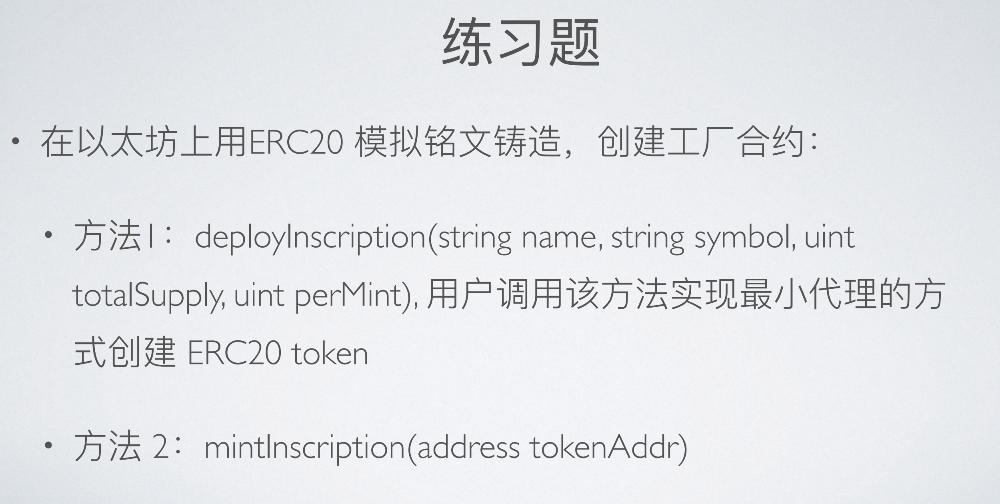

# 练习题（01.24）：练习题 1



## 1. 合约信息（2024.3.4 更新内容）

（*2024.3.4 修改代码中部分 bug，2024.3.6 修正业务逻辑，现已重新部署*）

**FairTokenGFT_V1 合约（implement 合约）**（2024.3.6 更新）：https://sepolia.etherscan.io/address/0x6731da3e4eb44b17764386be1f61dffca2065cfe

**ERC20TokenFactory_V1 合约已部署**（2024.3.6 更新）：https://sepolia.etherscan.io/address/0x6cc15e9c690ee8b8b168d60978c0b15cbaba07a1

**由工厂合约部署的一个合约实例**（2024.3.6 更新）：https://sepolia.etherscan.io/address/0x1B1B6b3161F4Dd0FEe8Bf103048a1b4cC36d770E

## 2. 铸造铭文的工厂合约：最小代理创建 ERC-20 token

#### **此合约部分状态变量与方法的说明：**

- **状态变量`libraryAddress`**：implement 合约的地址。
- **状态变量`InscriptionStruct`**：结构体，用于记录本工厂合约所部署的合约实例的信息（`name`、`symbol`、`totalSupply`、`perMint`）。
- **状态变量`inscriptionInfo`**：映射[ `合约实例地址` => `InscriptionStruct` ]。
- **事件`ImpleCloned`**：当部署新的铭文合约实例时触发，记录本工厂合约所部署的合约实例的地址。
- **事件`Minted`**：当铸造新的 token（铭文）时触发，记录新铸造的铭文地址与数量。
- **`deployInscription`方法**：使用 `Clone` 库中的 `clone` 方法基于 implement 合约的逻辑部署新的铭文合约实例，部署方式为代理调用（这将导致在部署时无法运行 implement 合约中 `constructor`中的代码，需要在新部署的合约实例中增设 `init` 方法“手动”初始化）。
- **`mintInscription`方法**：调用指定地址的 ERC20 Token 合约（由工厂合约部署合约实例）mint 方法为调用者铸造该合约实例的 token（token 数额为固定值，在调用`deployInscription` 方法创建合约实例时，由输入参数 `_perMint`确定）。
- **`setLibraryAddress`方法**：`onlyOwner`，指定 implement 合约的地址，便于升级/维护。
- **`setMaxAmountOfInscription`方法**：`onlyOwner`，指定最大可部署的合约实例数额（用于管理该合约）。

```solidity
// SPDX-License-Identifier: MIT
pragma solidity ^0.8.19;

import "./FairTokenGFT_V1.sol";
import "@openzeppelin/contracts/proxy/Clones.sol";
import "@openzeppelin/contracts/access/Ownable.sol";

/**
 * @title This is a factory contract that deploys inscription (ERC-20 token) contract instances by cloning a logic contract that provides the implementation of the inscription.
 *
 * @author Garen Woo
 */
contract ERC20TokenFactory_V1 is Ownable {
    using Clones for address;

    // This is the address of the implement contract(template of ERC20Token contract)
    address private libraryAddress;

    struct InscriptionStruct {
        string name;
        string symbol;
        uint256 totalSupply;
        uint256 perMint;
    }

    mapping(address => InscriptionStruct) public inscriptionInfo;

    event ImpleCloned(address instanceAddress);
    event Minted(address inscriptAddr, uint256 mintedAmount);

    error ReachMaxSupply(address inscriptAddr, uint256 currentSupply, uint256 mintedAmount, uint256 maxSupply);

    /**
     * @notice maxAmountOfInscription is a deterministic number that limits the maximum amount of inscription.
     * This parameter set a cap to avoid transaction failure which results from over-high gas.
     * This state variable can be modified by owner of this factory.
     */
    uint256 public maxAmountOfInscription = 10000;

    constructor(address _libraryAddress) Ownable(msg.sender) {
        libraryAddress = _libraryAddress;
    }

    /**
     * @dev Using the implement contract of libraryAddress, deploy its contract instance.
     *
     * @param _tokenName the name of the ERC20 token contract that will be deployed
     * @param _tokenSymbol the symbol of the ERC20 token contract that will be deployed
     * @param _tokenTotalSupply the maximum of the token supply(if this maximum is reached, token cannot been minted any more)
     * @param _perMint the fixed amount of token that can be minted once
     */
    function deployInscription(
        string memory _tokenName,
        string memory _tokenSymbol,
        uint256 _tokenTotalSupply,
        uint256 _perMint
    ) public returns (address) {
        address clonedImpleInstance = libraryAddress.clone();
        InscriptionStruct memory deployedInscription = InscriptionStruct({
            name: _tokenName,
            symbol: _tokenSymbol,
            totalSupply: _tokenTotalSupply,
            perMint: _perMint
        });
        inscriptionInfo[clonedImpleInstance] = deployedInscription;

        FairTokenGFT_V1(clonedImpleInstance).init(address(this), _tokenName, _tokenSymbol);
        emit ImpleCloned(clonedImpleInstance);
        return clonedImpleInstance;
    }

    /**
     * @dev Mint fixed amount of token in the contract of '_tokenAddr'.
     *
     * @param _tokenAddr the address of the contract instance which is cloned from the implement contract
     */
    function mintInscription(address _tokenAddr) public {
        _beforeMintInscription(_tokenAddr);
        uint256 amountPerMint = inscriptionInfo[_tokenAddr].perMint;
        FairTokenGFT_V1(_tokenAddr).mint(msg.sender, amountPerMint);
        emit Minted(_tokenAddr, amountPerMint);
    }

    /**
     * @dev Replace the address of the implement contract with a new one.
     * This function can only be called by the owner of this factory contract.
     */
    function setLibraryAddress(address _libraryAddr) public onlyOwner {
        libraryAddress = _libraryAddr;
    }

    /**
     * @dev Update the maximum of the ERC20 token contract instances
     */
    function setMaxAmountOfInscription(uint256 _newMaximum) external onlyOwner {
        maxAmountOfInscription = _newMaximum;
    }

    /**
     * @notice This function is used to get the current total amount of minted token. It's for the convenience of knowing
     * if the current total amount has reached the maximum.
     *
     * @param _tokenAddr the address of the contract instance which is cloned from the implement contract
     */
    function getInscriptionCurrentSupply(address _tokenAddr) public view returns (uint256) {
        return FairTokenGFT_V1(_tokenAddr).totalSupply();
    }

    /**
     * @dev Get the current address of the implement contract
     */
    function getLibraryAddress() public view returns (address) {
        return libraryAddress;
    }

    /**
     * @dev Get the information of the inscription at `_inscriptionAddr`.
     */
    function getInscriptionInfo(address _inscriptionAddr) public view returns (InscriptionStruct memory) {
        return inscriptionInfo[_inscriptionAddr];
    }

    function _beforeMintInscription(address _tokenAddr) internal view {
        uint256 currentTotalSupply = FairTokenGFT_V1(_tokenAddr).totalSupply();
        uint256 amountPerMint = inscriptionInfo[_tokenAddr].perMint;
        uint256 maxSupply = inscriptionInfo[_tokenAddr].totalSupply;
        if (currentTotalSupply + amountPerMint > maxSupply) {
            revert ReachMaxSupply(_tokenAddr, currentTotalSupply, amountPerMint, maxSupply);
        }
    }
}
```


## 3. ERC20 Token 合约：FairTokenGFT_V1

此合约为使用最小代理方式部署新合约实例的 implement 合约（也是逻辑合约）。

需注意的是，新的合约实例由`Clone`库的`clone`方法部署，该方法是通过代理调用实现的，导致无法运行 implement 合约的`constructor`。

#### **此合约部分状态变量与方法的说明：**

- **状态变量`factory`**：工厂合约的地址。
- **状态变量`_name`和`_symbol`**：由于部署合约未运行`constructor`中的赋值操作，导致 <u>ERC20 标准实现</u>的`_name` 和`_symbol`无法被赋值；此外，ERC20 Token 的`_name` 和`_symbol`为 <u>ERC20 标准实现</u>的私有变量，无法被子合约 {FairTokenGFT_V1} 继承，更不可能被直接访问或修改。因此，在当前合约声明此两个私有的状态变量，用于模拟 <u>ERC20 标准实现</u>中的`_name` 和 `_symbol`，并通过方法 {name} 和 {symbol} 分别访问者两个变量。
- **`init`方法**：用于模拟`constructor`的初始化 。
- **`mint`方法**：铸造新的铭文（ERC-20 token）。

```solidity
// SPDX-License-Identifier: MIT
pragma solidity ^0.8.19;

import "@openzeppelin/contracts/token/ERC20/ERC20.sol";
import "@openzeppelin/contracts/token/ERC20/extensions/ERC20Permit.sol";
import "@openzeppelin/contracts/utils/ReentrancyGuard.sol";
import "@openzeppelin/contracts/utils/Address.sol";
import "@openzeppelin/contracts/token/ERC20/utils/SafeERC20.sol";
import "@openzeppelin/contracts-upgradeable/proxy/utils/Initializable.sol";

interface ITokenBank {
    function tokensReceived(address, uint256) external returns (bool);
}

interface INFTMarket {
    function tokensReceived(address, uint256, bytes calldata) external;
}

contract FairTokenGFT_V1 is ERC20, ERC20Permit, ReentrancyGuard, Initializable {
    using SafeERC20 for FairTokenGFT_V1;
    using Address for address;

    address public factory;
    string private _name;
    string private _symbol;

    error NotFactory(address caller);
    error NoTokenReceived();
    error TransferTokenFail();
    error NotContract();

    event TokenMinted(address recipient, uint256 amount);
    event TransferedWithCallback(address target, uint256 amount);
    event TransferedWithCallbackForNFT(address target, uint256 amount, bytes data);

    constructor() ERC20("Garen Fair Token", "GFT") ERC20Permit("Garen Fair Token") {
        factory = msg.sender;
    }

    modifier onlyFactory() {
        if (msg.sender != factory) {
            revert NotFactory(msg.sender);
        }
        _;
    }

    function init(
        address _factory,
        string calldata _initName,
        string calldata _initSymbol
    ) external initializer {
        factory = _factory;
        _name = _initName;
        _symbol = _initSymbol;
    }

    function mint(address _recipient, uint256 _amount) external onlyFactory {
        _mint(_recipient, _amount);
        emit TokenMinted(_recipient, _amount);
    }

    // ERC20 Token Callback:
    function transferWithCallback(address _to, uint256 _amount) external nonReentrant returns (bool) {
        bool transferSuccess = transfer(_to, _amount);
        if (!transferSuccess) {
            revert TransferTokenFail();
        }
        if (_isContract(_to)) {
            bool success = ITokenBank(_to).tokensReceived(msg.sender, _amount);
            if (!success) {
                revert NoTokenReceived();
            }
        }
        emit TransferedWithCallback(_to, _amount);
        return true;
    }

    // ERC721 Token Callback:
    // @param: _data contains information of NFT, including ERC721Token address, tokenId and other potential information.
    function transferWithCallbackForNFT(address _to, uint256 _bidAmount, bytes calldata _data)
        external
        nonReentrant
        returns (bool)
    {
        if (_isContract(_to)) {
            INFTMarket(_to).tokensReceived(_to, _bidAmount, _data);
        } else {
            revert NotContract();
        }
        emit TransferedWithCallbackForNFT(_to, _bidAmount, _data);
        return true;
    }

    function name() public view override returns (string memory) {
        return _name;
    }

    function symbol() public view override returns (string memory) {
        return _symbol;
    }

    function _isContract(address account) internal view returns (bool) {
        return account.code.length > 0;
    }

    function getBytesOfNFTInfo(address _NFTAddr, uint256 _tokenId) public pure returns (bytes memory) {
        bytes memory NFTInfo = abi.encode(_NFTAddr, _tokenId);
        return NFTInfo;
    }
}
```


## 4. 测试用例代码

```solidity
// SPDX-License-Identifier: UNLICENSED
pragma solidity ^0.8.13;

import {FairTokenGFT_V1} from '../src/FairTokenGFT_V1.sol';
import {ERC20TokenFactory_V1} from '../src/ERC20TokenFactory_V1.sol';

import {Test, console} from "forge-std/Test.sol";

contract ERC20TokenFactory_V1_Test is Test {
    address alice = makeAddr("alice");
    address bob = makeAddr("bob");
    address carol = makeAddr("carol");

    FairTokenGFT_V1 public implementContract;
    ERC20TokenFactory_V1 public inscriptFactoryContract;

    address public implementAddr;
    address public inscriptFactoryAddr;
    

    function setUp() public {
        vm.startPrank(alice);
        implementContract = new FairTokenGFT_V1();
        implementAddr = address(implementContract);
        inscriptFactoryContract = new ERC20TokenFactory_V1(implementAddr);
        inscriptFactoryAddr = address(inscriptFactoryContract);
        deal(alice, 200000 ether);
        vm.stopPrank();
    }

    function test_DeployInscription() public {
        vm.startPrank(alice);
        address inscriptAddr = inscriptFactoryContract.deployInscription("OpenSpace Token", "OT", 10000, 1000);
        string memory inscriptName = inscriptFactoryContract.getInscriptionInfo(inscriptAddr).name;
        string memory inscriptSymbol = inscriptFactoryContract.getInscriptionInfo(inscriptAddr).symbol;
        uint256 inscriptTotalSupply = inscriptFactoryContract.getInscriptionInfo(inscriptAddr).totalSupply;
        uint256 inscriptPerMint = inscriptFactoryContract.getInscriptionInfo(inscriptAddr).perMint;
        vm.stopPrank();
        assertEq(inscriptName, "OpenSpace Token", "Expected name of the inscription is 'OpenSpace Token'!");
        assertEq(inscriptSymbol, "OT", "Expected symbol of the inscription is 'OT'!");
        assertEq(inscriptTotalSupply, 10000, "Expected totalSupply of the inscription is 10000!");
        assertEq(inscriptPerMint, 1000, "Expected perMint of the inscription is 1000!");
    }

    function test_MintInscription() public {
        vm.startPrank(alice);
        address inscriptAddr = inscriptFactoryContract.deployInscription("OpenSpace Token", "OT", 10000, 1000);
        uint256 inscriptPerMint = inscriptFactoryContract.getInscriptionInfo(inscriptAddr).perMint;
        FairTokenGFT_V1 inscriptInstance = FairTokenGFT_V1(inscriptAddr);    // the newly deployed inscription instance
        inscriptFactoryContract.mintInscription(inscriptAddr);
        uint256 tokenInUser = inscriptInstance.balanceOf(alice);
        vm.stopPrank();
        assertTrue(tokenInUser == inscriptPerMint, "Expect the inscription balance of user equal to perMint");
    }

}
```


#### 测试结果：


